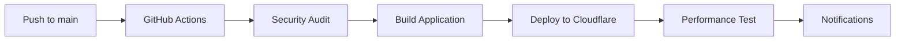

# Deployment Guide

## 🚀 Overview

This project uses a modern, optimized deployment pipeline with GitHub Actions and Cloudflare Pages. The deployment process includes automated security checks, performance monitoring, and comprehensive error handling.

## 🔄 Automatic Deployment

### Workflow Triggers

1. **Production Deployment**: Push to `main` branch
2. **Performance Testing**: Push to any branch or Pull Request
3. **Automatic Rollback**: Failed deployments trigger notifications

### Deployment Process



## 🔧 Required GitHub Secrets

Configure these in your repository settings → Secrets and variables → Actions:

### Required for Deployment
- `GROQ_API_KEY` - Groq AI service API key
- `CLOUDFLARE_API_TOKEN` - Cloudflare API token with Pages permissions
- `CLOUDFLARE_ACCOUNT_ID` - Your Cloudflare account ID

### Optional for Monitoring
- `NOTIFICATION_SERVICE` - Set to 'slack' or 'discord'
- `SLACK_WEBHOOK_URL` - Slack incoming webhook URL
- `DISCORD_WEBHOOK_URL` - Discord webhook URL
- `LHCI_GITHUB_APP_TOKEN` - Lighthouse CI GitHub app token

## 🏗️ Build Optimization

### Caching Strategy
- **pnpm Cache**: Stores node_modules across builds
- **Next.js Cache**: Incremental build caching
- **GitHub Actions Cache**: Multi-layer caching for faster builds

### Performance Features
- Package optimization for common dependencies
- Image optimization with WebP/AVIF formats
- Static asset compression and caching
- Bundle size optimization

## 🧪 Quality Assurance

### Automated Tests
- **Security Audit**: `pnpm audit --audit-level high`
- **Performance Test**: Lighthouse CI with Core Web Vitals
- **Build Validation**: TypeScript compilation and linting

### Performance Benchmarks
- **Performance Score**: ≥ 75%
- **Accessibility Score**: ≥ 90%
- **Best Practices**: ≥ 85%
- **SEO Score**: ≥ 80%

## 📊 Monitoring & Observability

### Deployment Monitoring
- **GitHub Actions**: Real-time build and deployment logs
- **Cloudflare Dashboard**: Analytics and performance metrics
- **Lighthouse Reports**: Automated performance testing

### Notifications
- **Success**: Deployment completion with URLs and IDs
- **Failure**: Error details and troubleshooting links
- **Performance**: Core Web Vitals regression alerts

## 🛠️ Manual Deployment

### Local Development
```bash
# Install dependencies
pnpm install

# Start development server
pnpm dev

# Type checking
pnpm type-check

# Code quality check
pnpm lint && pnpm format
```

### Production Deployment
```bash
# Build for production
pnpm build

# Deploy to Cloudflare Pages
pnpm deploy:prod

# Deploy to preview environment
pnpm deploy:preview
```

## 🔧 Environment Configuration

### Production Environment
Uses GitHub Secrets for security:
```bash
GROQ_API_KEY=ghs_***               # Auto-injected
CLOUDFLARE_API_TOKEN=***           # Auto-injected
CLOUDFLARE_ACCOUNT_ID=***          # Auto-injected
```

### Development Environment
Create `.env.local` file:
```env
# Groq AI API Key
GROQ_API_KEY=your_groq_api_key_here

# Transcription Configuration (Optional)
TRANSCRIPTION_TIMEOUT_MS=180000
TRANSCRIPTION_RETRY_COUNT=2
TRANSCRIPTION_MAX_CONCURRENCY=2
```

## 🚨 Troubleshooting

### Build Failures
1. **Security Audit Failed**: Update vulnerable dependencies
2. **TypeScript Errors**: Fix type issues before deployment
3. **Missing Secrets**: Verify all required secrets are configured

### Deployment Issues
1. **Cloudflare Token**: Ensure proper permissions (Pages:Edit)
2. **Account ID**: Verify correct Cloudflare account ID
3. **Build Size**: Check if build exceeds Cloudflare limits

### Performance Regression
1. **Bundle Size**: Analyze with webpack-bundle-analyzer
2. **Image Optimization**: Verify WebP/AVIF formats
3. **Caching**: Check CDN cache configuration

## 📈 Performance Optimization

### Build Optimization
- **Tree Shaking**: Remove unused code automatically
- **Code Splitting**: Dynamic imports for large dependencies
- **Image Optimization**: Modern formats and responsive sizing

### Runtime Optimization
- **Static Caching**: Long-term caching for assets (1 year)
- **Compression**: Gzip/Brotli compression enabled
- **CDN Optimization**: Cloudflare global edge network

### Monitoring Performance
```bash
# Local Lighthouse test
npx lighthouse https://umuo.app --output html

# Bundle analysis
npx webpack-bundle-analyzer .next/static/chunks/

# Performance budget check
npm run build && npx bundlesize
```

## 🔄 Rollback Strategy

### Automatic Rollback
- Failed deployments trigger notifications
- Previous version remains live until new deployment succeeds
- Rollback manual: redeploy previous commit or revert changes

### Manual Rollback
```bash
# View deployment history
git log --oneline -10

# Revert to previous commit
git revert HEAD

# Push rollback
git push origin main
```

## 📞 Support

### Resources
- **GitHub Actions Logs**: Repository → Actions tab
- **Cloudflare Dashboard**: Cloudflare Pages → Analytics
- **Performance Reports**: Lighthouse CI artifacts

### Contact
- Create GitHub Issue for deployment problems
- Check status page for service availability
- Review troubleshooting guide above